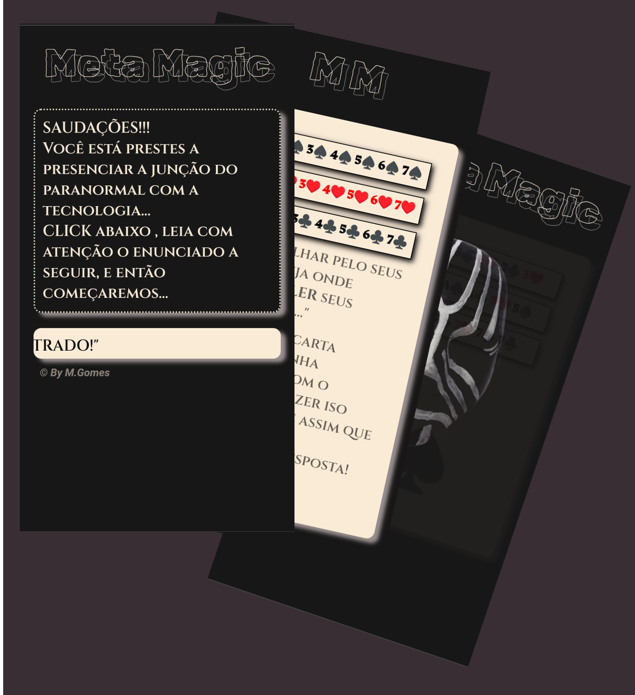

<h1 align="center"> Meta MAgic </h1>

Meu 1° projeto. Idealizado a partir de um truque de mágica, e colocado em um programa.

  <a href="#-tecnologias">Tecnologias</a>&nbsp;&nbsp;&nbsp;|&nbsp;&nbsp;&nbsp;
  <a href="#-projeto">Projeto</a>&nbsp;&nbsp;&nbsp;|&nbsp;&nbsp;&nbsp;
  <a href="#-layout">Layout</a>&nbsp;&nbsp;&nbsp;|&nbsp;&nbsp;&nbsp;
  <a href="#memo-licença">Licença</a>

  

 

  

## 🚀 Tecnologias

Esse projeto foi desenvolvido com as seguintes tecnologias:

- HTML e CSS
- JavaScript
- Git e Github

## 💻 Projeto

Meta Magic é um projeto recreativo, onde através de matemática, executa-se um truque de mágica com cartas. 
Consiste em ecolha de uma "carta" pelo usuário, simbolizada por alguns nipes do baralho, que será descoberta pelo mágico virtual. 
Claro, também utilzada um pouco de "teatro" nos enunciados do aplicativo para deixar um ambiente mistico. 

[Visite o projeto online](https://celo-gomes.github.io/metamagic)

## 🔖 Layout

O Layout do projeto é de deselvolvimento próprio, usando de criatividade e algumas pesquisas na web. 
Visando simplicidade, mas à futuro, pretende-se ter mais imagens e talvez animações. 

## :memo: Considerações

Esse projeto está sob a licença MIT. 
Menção a incrível trilha sonora, que foi retirada do tema pricipal do filme: 
🎵<strong>O ultimo dos Moicanos</strong> - The Last of the Mohicans. Assinada por Trevor Jones e Randy Edelman 
baseado na melodia The Gael, do cantor e compositor escocês Dougie MacLean. 👨‍🎤

---

Feito com ♥ by M. Gomes :wave: [Visite-nos no Github](https://github.com/celo-gomes)
